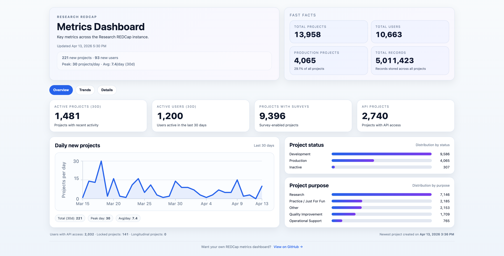
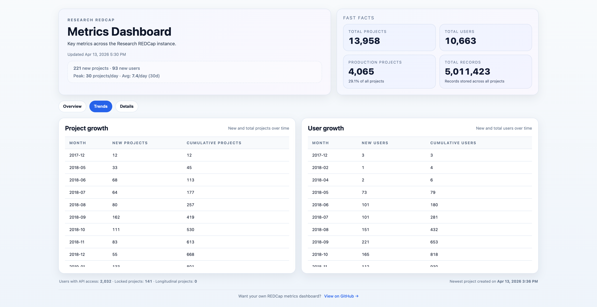
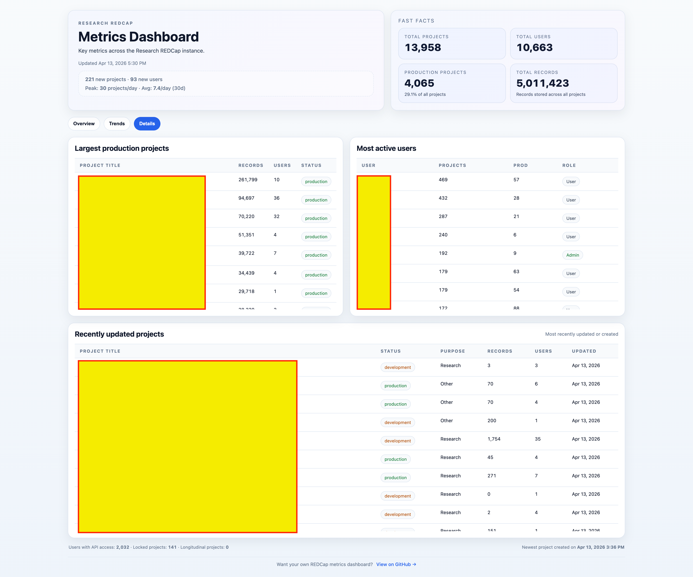

# REDCap Metrics Dashboard

A PHP-based dashboard that generates key metrics for a REDCap instance.

The dashboard is rendered as a static HTML file and refreshed every 15 minutes via cron. No frontend framework or runtime dependencies are required.

---

## Screenshots

### Overview



### Trends



### Details



---

## Overview

This project:

* Connects to a REDCap database
* Queries pre-built MySQL views
* Generates a fully self-contained HTML dashboard
* Outputs a static `index.html` file for web serving

---

## Project Structure

```
redcap_metrics_dashboard/
├── config.php            # Configuration (paths, titles, instance name)
├── generate.php          # Main script to generate dashboard
├── sql/
│   └── views.sql         # MySQL views required for metrics
├── screenshots/          # Dashboard screenshots
└── README.md
```

---

## Configuration

Edit `config.php` to match your environment:

```php
return [
    'connect_file' => '/path/to/redcap_connect.php',
    'app_title' => 'Your REDCap Metrics Dashboard',
    'instance_name' => 'Your REDCap Instance',
    'subtitle' => 'Key metrics across the REDCap instance.'
];
```

### Notes

* `connect_file` should point to your REDCap `redcap_connect.php`
* If not available, the script falls back to environment variables:

  * `REDCAP_DB_HOST`
  * `REDCAP_DB_NAME`
  * `REDCAP_DB_USER`
  * `REDCAP_DB_PASS`

---

## Database Setup

This dashboard depends on MySQL views that aggregate REDCap data.

### Required Views

* `view_redcap_metrics_projects`
* `view_redcap_metrics_users`

### Install Views

```bash
mysql -u <user> -p <database> < sql/views.sql
```

Or execute manually in your MySQL client.

> ⚠️ These views are required for the dashboard to function.

---

## Usage

### Run via CLI

```bash
php generate.php --output=/path/to/metrics/index.html
```

---

## Automated Generation (Cron)

Example cron job (runs every 15 minutes):

```bash
*/15 * * * * cd /path/to/metrics && \
/bin/php /path/to/redcap_metrics_dashboard/generate.php > index.html.tmp && \
mv -f index.html.tmp index.html && \
chown root:apache index.html && chmod 0640 index.html
```

### What this does

1. Generates a temporary HTML file
2. Atomically replaces `index.html`
3. Applies proper ownership and permissions

---

## Output

* Static HTML dashboard (`index.html`)
* No PHP execution required after generation
* Can be served directly via Apache/Nginx

---

## Features

### Summary Metrics

* Total users
* Total projects
* Production vs non-production projects
* Total records

### Activity Metrics

* Active users (last 30 days)
* Active projects (last 30 days)
* Daily project creation trends

### Growth Trends

* Monthly user growth
* Monthly project growth
* Cumulative totals over time

### Data Breakdown

* Project status distribution
* Project purpose distribution

### Detailed Views

* Most active users
* Largest production projects
* Recently updated projects

### Visualization

* Inline SVG charts (no external libraries)
* Interactive sparklines with tooltips

---

## Database Connection Behavior

The script supports:

* REDCap native connection (`redcap_connect.php`)
* PDO (`$pdo` or `$db`)
* MySQLi (`$conn`)
* Fallback to environment variables

---

## Requirements

* PHP 8+
* MySQL or MariaDB
* Access to REDCap database

---

## Security Notes

* Output is static HTML (safe for internal dashboards)
* No database credentials are exposed
* Ensure proper file permissions on generated output

---

## Customization

You can customize:

* Titles and labels via `config.php`
* Styling directly in `generate.php`
* Metrics by modifying SQL queries

---

## License

Internal use (customize as needed)
